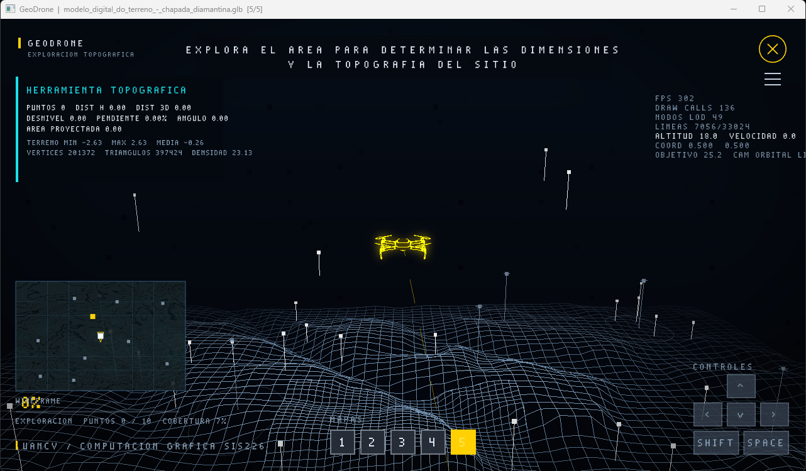
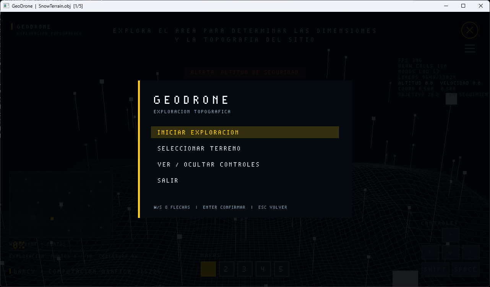
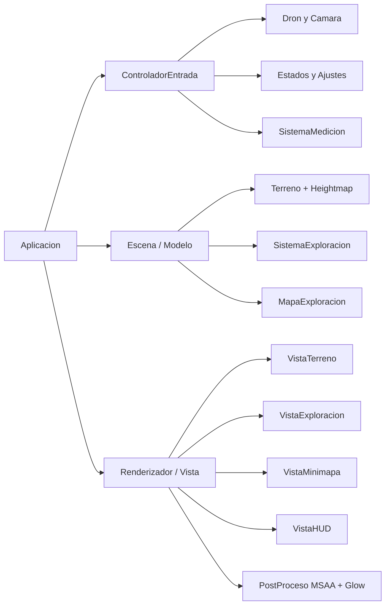
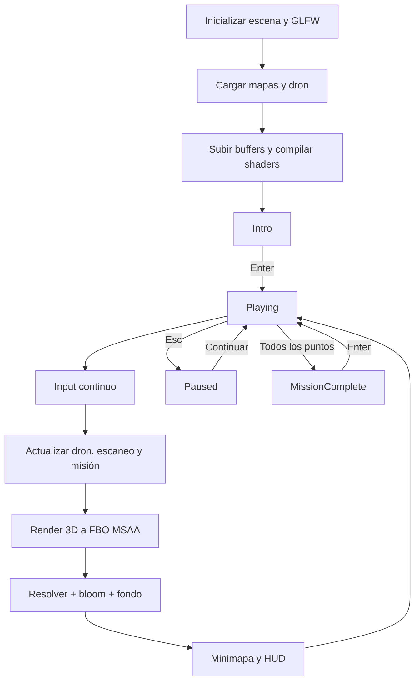

# GeoDrone – Simulador de Exploración Topográfica

Aplicación académica de escritorio en C++17 y OpenGL 3.3 para pilotar un dron, inspeccionar terrenos y completar una misión reproducible de levantamiento topográfico. La identidad visual es propia: fondo azul-negro, cartografía luminosa, balizas de escaneo y dron amarillo.

## 🎞️ Video explicativo del Proyecto

🔗 [Ver video en YouTube](https://youtu.be/dvRV8CqVoFs)

---



## 1. Inicio rápido

Requisitos: Windows 10/11, GPU con OpenGL 3.3 Core y MinGW-w64/MSYS2 con `g++` en `PATH`.

```bat
compilar.bat
simulador.exe
```

Para compilar y ejecutar en un solo paso:

```bat
compilar.bat ejecutar
```

La ruta del proyecto puede contener espacios. El script entra primero en su propia carpeta y cita rutas y archivos.

## 2. Objetivo académico

El proyecto permite explicar con una aplicación real:

- el pipeline programable de OpenGL;
- la relación entre VAO, VBO y EBO;
- transformaciones Model, View y Projection;
- carga y normalización de OBJ, GLB, GLTF y CSV/WKT;
- heightmaps, interpolación bilineal y curvas de nivel;
- cámara orbital y seguimiento temporal;
- animación de un modelo GLB y hélices en shader;
- exploración por celdas, progreso real y minimapa;
- mediciones de distancia, desnivel, pendiente y área.

No incluye nombres, logotipos, código ni recursos del sitio usado como referencia conceptual.

## 3. Experiencia de exploración

Al iniciar se muestra un menú propio. La misión crea diez zonas válidas con semilla fija. Cada zona se apoya en el heightmap, rechaza pendientes extremas y mantiene una separación mínima respecto a las demás.

Una zona pasa por `Pendiente → Cercano → Escaneando → Completado`. Para escanear hay que permanecer dentro del anillo, entre 1,5 y 28 unidades sobre el suelo y a menos de 14 unidades/s. El progreso usa `deltaTime`; al salir disminuye gradualmente. Una zona completada queda persistente y revela un área mayor del terreno.

## 4. Capturas



La primera captura muestra el HUD durante una inspección con minimapa y herramienta topográfica. La segunda muestra el menú inicial navegable con teclado.

## 5. Tecnologías

| Tecnología | Uso |
|---|---|
| C++17 | Modelo, control, loaders y gestión de recursos |
| OpenGL 3.3 Core | Render 3D/2D, MRT, MSAA y postproceso |
| GLFW | Ventana, contexto e input |
| GLAD | Resolución de funciones OpenGL |
| GLM | Vectores, matrices, cuaterniones y ray casting |
| tinygltf | Lectura GLB/GLTF y skin del dron |
| stb_easy_font | Texto vectorial ASCII del HUD |
| stb_image | Dependencia de tinygltf |

## 6. Arquitectura

La base conserva el patrón Modelo–Vista–Controlador existente y lo amplía. El modelo no llama a OpenGL; las vistas poseen o reciben recursos GPU; el controlador traduce eventos GLFW.



Más detalles en [docs/IMPLEMENTACION.md](docs/IMPLEMENTACION.md).

## 7. Flujo de ejecución



## 8. Terrenos y loaders

El descubrimiento recorre `assets/`, ignora archivos cuyo nombre contiene `drone`/`dron` y admite:

- OBJ: parser propio, caras de N lados trianguladas por abanico;
- GLB/GLTF: `POSITION` e índices mediante tinygltf;
- CSV: extracción de geometrías WKT `LINESTRING` y corrección por latitud;
- dron GLB: skinning de pose de reposo en CPU e identificación de cuatro hélices.

Cada mapa se centra, se orienta a Y-up, se escala a 100 unidades, genera un heightmap 256×256, una rejilla 129×129, quadtree, zonas y minimapa. Un fallo de un mapa se informa sin alterar el catálogo.

## 9. Modos de visualización

La tecla `V` rota entre:

1. Wireframe.
2. Nube de puntos.
3. Wireframe + nube de puntos.
4. Superficie semitransparente + wireframe.
5. Mapa de elevación.
6. Escaneo.

El shader combina altura, iluminación direccional sencilla, distancia a cámara, foco del dron y textura de exploración. La densidad de wireframe y la intensidad de puntos se ajustan en pausa.

## 10. Curvas de nivel

Las curvas se representan de dos formas complementarias:

- bandas de altura procedurales sobre la superficie;
- isolíneas en el minimapa, derivadas del heightmap.

`H` permite activarlas o desactivarlas. El módulo histórico de Marching Squares se conserva para análisis y generación incremental.

## 11. Revelado y progreso

`MapaExploracion` utiliza `std::vector<uint8_t>` de 65.536 celdas. Mantiene un contador incremental para consultar la cobertura en O(1). `SistemaEscaneo` usa una cola FIFO y una máscara `enCola` para procesar lotes acotados sin duplicados.

La máscara se sube como textura `GL_R8`; por tanto, el shader recibe una sola rejilla compacta y no cientos de uniforms. El porcentaje principal proviene del progreso real de zonas; el HUD también muestra cobertura real por celdas.

## 12. Dron

El dron conserva `assets/animated_drone.glb`. El movimiento aplica aceleración, frenado, suavizado independiente de FPS, yaw interpolado, pitch/roll visual, estabilización y flotación en reposo. Las hélices giran en GPU alrededor de pivotes extraídos del skin.

Los límites se calculan con el heightmap: el dron no baja de 2,5 unidades sobre el suelo, no supera 85 unidades relativas y no sale de la caja del mapa. El HUD alerta por baja altitud o proximidad al borde.

## 13. Cámara

`C` cambia entre:

- orbital libre;
- seguimiento cinematográfico con retraso de yaw;
- inspección superior.

El ratón orbita, la rueda ajusta distancia y `F` recentra detrás del dron. Elevación, zoom y distancia están limitados. La posición final se corrige contra el heightmap para no atravesar el terreno.

## 14. Minimap

No es una imagen estática. `VistaMinimapa` crea una textura desde las alturas del mapa y otra desde la máscara explorada. Muestra relieve, bandas, cuadrícula, zonas pendientes/completadas, siguiente objetivo, dron y orientación. Mantiene la conversión lineal entre límites de mundo y panel 2D.

## 15. Herramientas topográficas

`X` entra o sale del modo de medición. Clic izquierdo lanza un rayo desde la cámara y busca la intersección con el heightmap; clic derecho limpia puntos.

Con dos puntos se calcula distancia horizontal, desnivel, distancia 3D, pendiente porcentual y ángulo. Con tres o más se calcula el área proyectada mediante la fórmula del cordón. El panel también informa alturas mínima/máxima/media, vértices, triángulos y densidad.

## 16. HUD, estados y menús

Estados implementados: `Loading`, `Intro`, `Playing`, `Paused`, `MissionComplete` y `Error`. La vista normal informa terreno, estado, misión, FPS, altitud, velocidad, coordenadas normalizadas, siguiente objetivo, modo de cámara, modo visual, progreso, puntos y cobertura.

El menú de pausa permite continuar, reiniciar, cambiar mapa, configurar o salir. Configuración usa valores discretos y teclado para evitar una dependencia UI adicional.

## 17. Controles

| Entrada | Acción |
|---|---|
| W/A/S/D o flechas | Movimiento horizontal |
| Espacio / Shift | Subir / bajar |
| Arrastre izquierdo | Órbita de cámara |
| Rueda | Zoom |
| C / F | Cambiar cámara / recentrar |
| V | Cambiar visualización |
| M / H / L | Minimapa / curvas / ruta |
| X | Modo de medición |
| F1 / F3 | Controles / estadísticas |
| Tab / Backspace | Mapa siguiente / anterior |
| 1…9 | Seleccionar mapa |
| R | Reiniciar misión |
| F5 / F9 | Guardar / cargar exploración |
| Esc o P | Pausa |

Consulta [docs/CONTROLES.md](docs/CONTROLES.md) para detalles de menús y medición.

## 18. Renderizado y rendimiento

- FBO con dos attachments MRT: color y emisión.
- MSAA 4× real en renderbuffers y resolución a texturas antes de postproceso.
- bloom a media resolución con desenfoque gaussiano separable.
- degradado, partículas procedurales y viñeta en composición.
- depth testing, mezcla alfa, line smoothing y polygon offset.
- quadtree para LOD/culling del terreno y BVH para balizas decorativas.
- VBO dinámicos reutilizados; ningún modelo o shader se recarga dentro del loop.
- wrappers RAII move-only para shaders/programas y recursos GPU nuevos; módulos heredados liberan explícitamente.

## 19. Pruebas

```bat
simulador.exe --validar-assets
simulador.exe --pruebas-modelo
```

La primera orden cargó correctamente los cinco mapas y el dron. La segunda completó zonas de escaneo en cada mapa y verificó colisión y distancia 3D. La compilación se ejecutó con `compilar.bat`. Resultados y límites de la prueba gráfica están en [docs/PRUEBAS.md](docs/PRUEBAS.md).

## 20. Solución de problemas, limitaciones y futuro

- Si falta `g++`, instala MinGW-w64/MSYS2 y revisa `PATH`.
- Ejecuta desde la raíz: los shaders y assets usan rutas relativas.
- Si OpenGL 3.3 o FBO MSAA no están disponibles, la consola muestra el recurso exacto que falló.
- `stb_easy_font` es ASCII; los textos internos evitan tildes.
- `difuso.png` es una fotografía y `especular.png` un gráfico institucional, no mapas UV/PBR; no se conectan deliberadamente.
- El CSV describe líneas y se representa como red plana; no inventa triángulos de superficie.
- No se añadió audio para evitar una dependencia pesada.

Mejoras futuras razonables: persistir el estado individual de cada zona, atlas tipográfico Unicode, selección configurable de número de objetivos, telemetría exportable a CSV y pruebas visuales automatizadas con captura directa de ventana.

Consulta también [docs/CAMBIOS.md](docs/CAMBIOS.md).
