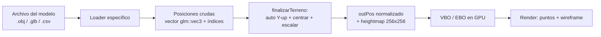
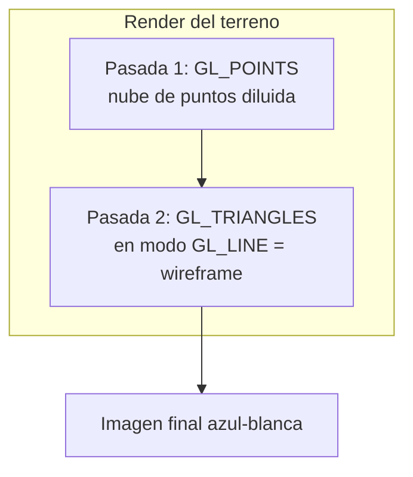
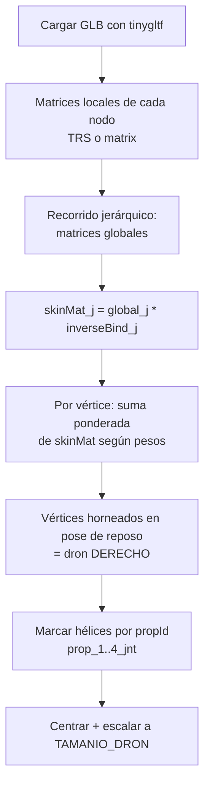
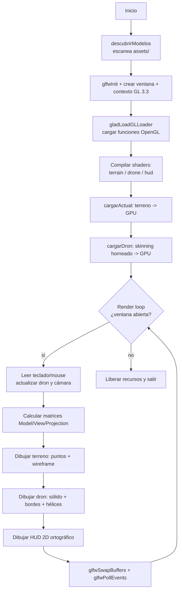
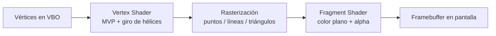

<div align="center">

# 🏔️ UNIVERSIDAD NACIONAL DEL ALTIPLANO

## Ingeniería de Sistemas

### Computación Gráfica

**Autor:** Jhon Aguilar


</div>

---

# 🛰️ Simulador Topográfico con Dron
## Exploración y Mapeo Topográfico Interactivo mediante OpenGL y C++

> Visor 3D interactivo que carga modelos de elevación del terreno (DEM), mallas urbanas y redes de calles, y permite **explorarlos con un dron** controlable en tercera persona — inspirado en la estética de los simuladores industriales de exploración minera y topográfica.

---

## 📖 Descripción Breve

El **Simulador Topográfico con Dron** es una aplicación de escritorio escrita en **C++17** sobre **OpenGL 3.3 Core Profile** que reconstruye y visualiza superficies topográficas en tiempo real. El usuario "sobrevuela" distintos terrenos con un **dron 3D animado** (hélices girando) mientras observa la superficie representada como una **malla de alambre (wireframe)** acompañada de una **nube de puntos**, con la estética azul-blanca sobre fondo oscuro típica de los simuladores de prospección.

| Aspecto | Detalle |
|---------|---------|
| **¿Qué hace?** | Carga terrenos 3D (`.obj`, `.glb`/`.gltf`) y mapas de calles (`.csv`), los normaliza y los dibuja como malla + nube de puntos. Un dron controlable los explora. |
| **Propósito** | Servir como **visor topográfico interactivo** y como ejercicio académico completo del **pipeline gráfico moderno** (VAO/VBO/EBO, shaders, MVP, skinning). |
| **Tecnologías** | C++17, OpenGL 3.3, GLFW, GLAD, GLM, tinygltf, stb_easy_font. |
| **Problema que resuelve** | Permite **inspeccionar y comparar** rápidamente varios modelos digitales de elevación y mallas urbanas dentro de un mismo entorno, cambiando de mapa en caliente y navegando libremente. |
| **Relación con la topografía** | Los modelos `.glb` son **DEM reales** (Modelos Digitales de Terreno) y el `.csv` es la **red vial real de Puno** (OpenStreetMap). El simulador los reproyecta a un espacio normalizado y reconstruye su relieve. |
| **Uso de OpenGL** | Todo el renderizado (malla, puntos, dron animado por skinning, HUD 2D) se realiza con OpenGL moderno: shaders GLSL, buffers en GPU y transformaciones matriciales. |

La explicación de cada subsistema es técnica pero busca ser comprensible: se documenta el **flujo de datos desde el archivo del modelo hasta el píxel en pantalla**.

---

## ✨ Características del Proyecto

- 🗺️ **Renderizado 3D** del terreno como **wireframe + nube de puntos** (estilo prospección).
- 🛩️ **Dron 3D animado** (`animated_drone.glb`) con **hélices girando** en tiempo real.
- 🎮 **Cámara orbital en tercera persona** que sigue al dron.
- 🕹️ **Navegación interactiva libre** (sin colisión): flechas/WASD + altura con Espacio/Shift.
- 📂 **Carga multi-formato**: `.obj`, `.glb`/`.gltf` y `.csv` (red de calles).
- 🔄 **Cambio de mapa en caliente** mediante teclas o **botones clicables en pantalla**.
- 🧭 **Auto-orientación de ejes** (corrige modelos *Z-up* que aparecerían "de pie").
- 📐 **Normalización automática** (centrado y escalado uniforme) de cualquier modelo.
- ⛰️ **Mapa de alturas** (heightmap) generado para posicionar el dron sobre el relieve.
- 🦴 **Skinning en CPU** del dron (esqueleto de 88 *joints*) horneado a pose de reposo.
- 🧩 **HUD 2D** con texto vectorial: botones de mapa y controles de movimiento.
- ⌨️🖱️ **Entrada por teclado y mouse** (rotación por arrastre, zoom por scroll).

> ⚠️ **Nota de honestidad técnica:** el pipeline actual usa **coloreado plano (flat color)**. La **iluminación basada en normales** y el **mapeo de texturas** (`difuso.png`, `especular.png`) **no están conectados** a los shaders todavía — se documentan como *trabajo futuro* en las conclusiones.

---

## 🧰 Tecnologías Utilizadas

| Tecnología | Tipo | Rol en el proyecto |
|------------|------|--------------------|
| **C++17** | Lenguaje | Lógica del programa, `std::filesystem`, lambdas, contenedores STL. |
| **OpenGL 3.3 Core** | API gráfica | Pipeline programable: shaders, buffers en GPU, rasterización. |
| **GLFW 3.x** | Ventana / entrada | Creación de la ventana, contexto OpenGL y *callbacks* de teclado/mouse. |
| **GLAD** | Cargador de funciones | Resuelve los punteros a funciones de OpenGL en tiempo de ejecución. |
| **GLM** | Matemática | Vectores, matrices, cuaterniones y transformaciones (MVP, `lookAt`, `perspective`). |
| **tinygltf** | Carga de modelos | Lectura de `.glb`/`.gltf` (geometría y esqueleto del dron). |
| **nlohmann/json** | Dependencia de tinygltf | Parseo del JSON interno de los archivos glTF. |
| **stb_image** | Dependencia de tinygltf | Decodificación de imágenes embebidas en los `.glb`. |
| **stb_easy_font** | Texto 2D | Generación de geometría de texto para el HUD (sin texturas de fuente). |
| **Parser OBJ propio** | Algoritmo propio | Lectura manual de `.obj` con triangulación *fan* (sin Assimp ni TinyObjLoader). |
| **Parser CSV/WKT propio** | Algoritmo propio | Extracción de geometrías `LINESTRING` de la red de calles. |
| **Git LFS** | Versionado | Almacenamiento de los modelos `.glb` (archivos grandes). |

> 🔎 Este proyecto **no usa Assimp ni TinyObjLoader**: el formato OBJ se interpreta con un parser propio y los formatos glTF/GLB con **tinygltf**.

---

## 🗂️ Organización de Carpetas

```
Mi Proyecto 1/
├── assets/                          # Modelos 3D y datos topográficos
│   ├── SnowTerrain.obj              # Terreno de prueba (OBJ)
│   ├── cabo_tinoso_modelo3d_acb-dem.glb        # DEM costero (GLB)
│   ├── ciudad_universitaria_unam (1).glb       # Malla urbana (GLB)
│   ├── modelo_digital_do_terreno_-_chapada_diamantina.glb  # DEM (GLB)
│   ├── calles_puno.csv              # Red vial de Puno (OSM, WKT LINESTRING)
│   └── animated_drone.glb           # Dron animado con esqueleto (usado)
├── shaders/
│   ├── terrain.vert / terrain.frag  # Terreno (wireframe + puntos)
│   ├── drone.vert   / drone.frag    # Dron (skinning horneado + giro de hélices)
│   └── hud.vert     / hud.frag      # HUD 2D (ortográfico)
├── src/
│   ├── main.cpp                     # Toda la lógica del simulador
│   ├── glad.c                       # Implementación del cargador GLAD
│   └── stb_image.h
├── include/                         # GLFW, GLAD, KHR, glm, tinygltf, json, stb_*
├── lib/
│   └── libglfw3.a                   # Biblioteca estática de GLFW
├── difuso.png / especular.png       # Texturas disponibles (no conectadas aún)
├── compilar.bat                     # Script de compilación (g++)
└── README.md
```

---

## 🧱 Estructura de Datos Utilizada

El proyecto evita clases pesadas y se apoya en **contenedores STL + tipos de GLM**, manteniendo los datos en formatos directamente cargables a la GPU.

### Almacenamiento de vértices e índices

```cpp
std::vector<float>        outPos;   // posiciones xyz aplanadas: [x0,y0,z0, x1,y1,z1, ...]
std::vector<unsigned int> outIdx;   // índices de triángulos (terreno) o de líneas (CSV)
std::vector<glm::vec3>    raw;      // posiciones crudas antes de normalizar
std::unordered_map<unsigned int, unsigned int> remap; // deduplicación de vértices OBJ
```

| Estructura | Uso |
|------------|-----|
| `std::vector<float>` | Posiciones de vértices listas para `glBufferData`. El dron usa **vértices intercalados** `[x, y, z, propId]` (4 floats). |
| `std::vector<unsigned int>` | Índices: tripletas para triángulos del terreno, **pares** para los segmentos de calle del CSV. |
| `std::vector<glm::vec3>` | Geometría intermedia (cómputo de *bounding box*, reorientación, normalización). |
| `std::unordered_map` | Remapeo de índices del OBJ a un arreglo compacto (solo vértices realmente usados). |
| `std::vector<glm::mat4>` | Matrices locales/globales de los nodos del esqueleto y matrices de *skin*. |
| `glm::vec3 / glm::mat4` | Vectores y matrices para cámara, dron y transformaciones MVP. |
| `std::vector<float>` (`g_altura`) | **Heightmap** 256×256 que guarda la altura máxima por celda. |

### VAO, VBO y EBO

El simulador usa el modelo de buffers de OpenGL moderno:

- **VBO (Vertex Buffer Object):** bloque de memoria en la GPU con las posiciones de los vértices.
- **EBO (Element Buffer Object):** índices que indican **cómo conectar** los vértices (triángulos o líneas), evitando duplicar datos.
- **VAO (Vertex Array Object):** "receta" que recuerda qué VBO/EBO usar y cómo interpretar cada atributo.

Fragmento real de subida del terreno a la GPU (`subirTerreno`):

```cpp
glGenVertexArrays(1, &vM); glGenBuffers(1, &bM); glGenBuffers(1, &eb);
glBindVertexArray(vM);

glBindBuffer(GL_ARRAY_BUFFER, bM);            // VBO con posiciones
glBufferData(GL_ARRAY_BUFFER, pos.size()*sizeof(float), pos.data(), GL_STATIC_DRAW);

glBindBuffer(GL_ELEMENT_ARRAY_BUFFER, eb);    // EBO con índices
glBufferData(GL_ELEMENT_ARRAY_BUFFER, idx.size()*sizeof(unsigned int), idx.data(), GL_STATIC_DRAW);

glVertexAttribPointer(0, 3, GL_FLOAT, GL_FALSE, 3*sizeof(float), (void*)0);  // atributo 0 = posición
glEnableVertexAttribArray(0);
```

Para el dron, el VAO declara **dos atributos** sobre un buffer intercalado:

```cpp
glVertexAttribPointer(0, 3, GL_FLOAT, GL_FALSE, 4*sizeof(float), (void*)0);              // posición
glVertexAttribPointer(1, 1, GL_FLOAT, GL_FALSE, 4*sizeof(float), (void*)(3*sizeof(float))); // propId (qué hélice)
```

### Organización de la información del terreno

Tras cargarse, **cualquier** modelo pasa por `finalizarTerreno()`, que centra y escala los datos a un ancho objetivo común (`ANCHO_OBJETIVO = 100`) y construye el heightmap. Así, terrenos de tamaños y unidades muy distintos se vuelven comparables.

---

## ⛰️ Funcionamiento de la Malla en los Mapas 3D

### Generación del terreno

El terreno **no se genera proceduralmente**: se reconstruye a partir de datos reales (DEM/mallas) o de líneas (calles). El flujo es:



### Construcción de la malla y conexión de vértices

- **OBJ:** se leen las posiciones `v` y las caras `f`. Las caras con más de 3 vértices se **triangulan por abanico (*fan triangulation*)**: `(0,1,2), (0,2,3), …`. Los vértices se **deduplican** con un `unordered_map`.

```cpp
// Triangulación fan de una cara con N vértices
for (size_t i = 1; i + 1 < cara.size(); ++i) {
    tri.push_back(cara[0]);
    tri.push_back(cara[i]);
    tri.push_back(cara[i + 1]);
}
```

- **GLB/GLTF:** tinygltf entrega los `accessors` de `POSITION` y los índices, que se copian respetando su `componentType` (`UNSIGNED_SHORT` / `UNSIGNED_INT`).
- **CSV (calles):** cada `LINESTRING` se convierte en una **polilínea**; los vértices consecutivos se conectan con **pares de índices** (segmentos `GL_LINES`).

### ¿Qué son los triángulos de la malla?

Cada tres índices definen un **triángulo**, la unidad mínima rasterizable. Una malla topográfica densa es un **TIN** (*Triangulated Irregular Network*) o una **rejilla regular** triangulada: miles de triángulos cuyos vértices llevan la elevación real del terreno en su coordenada **Y**.

### Renderizado del terreno (dos pasadas)



La nube de puntos se **diluye de forma adaptativa** para no saturar la vista en modelos enormes:

```cpp
int paso = std::max(1, numV / PUNTOS_MAX); // PUNTOS_MAX = 35000
for (int v = 0; v < numV; v += paso) { /* copiar 1 de cada 'paso' vértices */ }
```

### Representación de la elevación / topografía

La elevación vive en la coordenada **Y**. Para que los DEM exportados como *Z-up* no aparezcan "de pie", `finalizarTerreno()` **detecta el eje de menor extensión** (que en un terreno casi plano es la altura) y lo reasigna a Y:

```cpp
glm::vec3 span = bMax - bMin;
int up = 0;
if (span.y <= span.x && span.y <= span.z) up = 1;        // ya es Y-up
else if (span.z <= span.x && span.z <= span.y) up = 2;   // era Z-up -> corregir
int a = (up + 1) % 3, b = (up + 2) % 3;
for (auto& p : raw) { glm::vec3 q(p[a], p[up], p[b]); p = q; }
```

A partir de la malla normalizada se construye un **mapa de alturas** (heightmap) que guarda la altura máxima por celda, consultable por **interpolación bilineal** para colocar el dron sobre el relieve:

```cpp
float alturaTerreno(float x, float z) {
    // ... mapea (x,z) a la rejilla y mezcla las 4 celdas vecinas (bilineal)
    float a = h00*(1-tx) + h10*tx;
    float b = h01*(1-tx) + h11*tx;
    return a*(1-tz) + b*tz;
}
```

### Texturas y normales (estado actual)

- **Texturas:** existen `difuso.png` y `especular.png` y `stb_image` está compilado, **pero el fragment shader actual produce color plano**, no muestrea texturas. Se deja como mejora futura el mapeo difuso/especular.
- **Normales / iluminación:** el terreno se dibuja como wireframe + puntos sin sombreado, por lo que **no se calcula iluminación por normales** en esta fase. La sensación de relieve proviene de la geometría y la cámara.

---

## 🛩️ Funcionamiento del Dron

El dron es un modelo **`animated_drone.glb`** con un **esqueleto de 88 *joints*** (325 nodos) y mallas *skinned*. Para mostrarlo correctamente sin implementar un motor de animación completo, se aplica una técnica de **horneado de pose en CPU**:



Fragmento real del *skinning* por vértice:

```cpp
glm::mat4 sk(0.0f); float wsum = 0;
for (int k = 0; k < 4; k++) {
    float ww = wp[k];               // peso del joint k
    if (ww <= 0) continue;
    sk += ww * skinMat[jt[k]];      // skinMat = global[joint] * inverseBind[joint]
    wsum += ww;
}
glm::vec4 wpos = sk * vpos;         // vértice llevado a su posición de reposo en el mundo
```

### Hélices girando (animación procedimental)

Las 4 hélices (`prop_1_jnt … prop_4_jnt`) se identifican por nombre y cada vértice recibe un `propId`. El **vertex shader** las hace girar alrededor de su pivote, alternando el sentido como un cuadricóptero real:

```glsl
// drone.vert
if (pid >= 1) {
    vec3 pivot = uPivots[pid - 1];
    float dir  = (pid == 1 || pid == 3) ? 1.0 : -1.0;
    float ang  = uTime * uSpin * dir;
    float c = cos(ang), s = sin(ang);
    p -= pivot;
    p = vec3(c*p.x + s*p.z, p.y, -s*p.x + c*p.z); // giro sobre el eje Y
    p += pivot;
}
```

### Render del dron: sólido + bordes

Se dibuja en **dos pasadas** para resaltar su estructura sin saturarla de líneas: relleno oscuro (con *polygon offset*) que **oculta las aristas traseras**, y encima las **aristas amarillas** del frente.

### Movimiento, cámara y navegación

| Acción | Control |
|--------|---------|
| Mover el dron (adelante/atrás/lados) | Flechas o **W A S D** |
| Subir / bajar | **Espacio** / **Shift** |
| Rotar la vista (orbital) | **Arrastrar** botón izquierdo del mouse |
| Acercar / alejar (zoom) | **Scroll** |
| Cambiar de mapa | Teclas **1–9**, **Tab** / **Backspace**, o **botones en pantalla** |
| Salir | **ESC** |

El movimiento es **relativo a la cámara**: "adelante" siempre apunta hacia donde mira el usuario. El dron gira para encarar la dirección de avance (`atan2`). **No hay física de colisión**: el dron vuela libremente (decisión de diseño para una exploración fluida tipo *fly-through*).

```cpp
glm::vec3 adelante = glm::normalize(glm::vec3(-sinf(yawR), 0, -cosf(yawR)));
glm::vec3 derecha  = glm::normalize(glm::vec3( cosf(yawR), 0, -sinf(yawR)));
// ... acumula dirección según teclas y avanza
dronPos += mov * VEL_DRON * dt;
dronYaw  = glm::degrees(atan2f(mov.x, mov.z)) + DRON_OFFSET_YAW;
```

La **cámara es orbital en tercera persona**: se ubica en coordenadas esféricas alrededor del dron (`camYaw`, `camElev`, `camRadius`) y siempre lo mira:

```cpp
glm::vec3 camPos = dronPos + glm::vec3(
    camRadius*cosf(elevR)*sinf(yawR),
    camRadius*sinf(elevR),
    camRadius*cosf(elevR)*cosf(yawR));
glm::mat4 view = glm::lookAt(camPos, dronPos, glm::vec3(0,1,0));
```

> 🛰️ **Analogía con drones topográficos reales:** un dron de mapeo recorre un área capturando puntos de la superficie (fotogrametría / LiDAR) que luego se reconstruyen como una nube de puntos y una malla. Aquí el flujo es inverso y didáctico: ya tenemos el DEM y "volamos" sobre él para inspeccionarlo, replicando la **experiencia de exploración** más que el proceso de captura.

---

## 🏭 Relación con el Caso Real de Orano

Referencia: [Orano — Innovation Experience](https://www.orano.group/experience/innovation/en)

Las empresas industriales y mineras emplean **gemelos digitales** y simuladores de exploración para estudiar un yacimiento **antes** de intervenir físicamente: drones y sensores levantan la topografía, y un visor 3D permite recorrer el terreno, medir dimensiones y planificar operaciones. Este proyecto académico se inspira en esa **idea de exploración previa**:

- Reproduce la **estética de prospección** (malla de alambre y nube de puntos sobre fondo oscuro) que comunica "datos capturados del terreno".
- Coloca un **dron como avatar de navegación**, igual que en los recorridos industriales donde un vehículo aéreo guía la exploración del sitio.
- Permite **comparar varios escenarios** (distintos DEM y una red urbana real), análogo a evaluar diferentes zonas candidatas.

A diferencia del caso industrial —que parte de la **captura** de datos y los procesa con fotogrametría, georreferenciación y análisis geológico—, esta versión académica se centra en la **visualización e interacción** sobre datos ya existentes. La inspiración es conceptual: **el README y el código son originales**, sin reproducir contenido de la página de Orano.

---

## 🏛️ Arquitectura del Proyecto



### Pipeline gráfico (resumen)



1. **Inicialización OpenGL:** GLFW crea la ventana y el contexto 3.3 Core; GLAD resuelve las funciones; se activan `GL_DEPTH_TEST` y *blending*.
2. **Carga de modelos:** se descubren los archivos de `assets/`, se carga el terreno activo y, una vez, el dron.
3. **Render loop:** por cada frame se lee la entrada, se mueven dron y cámara, se calculan las matrices MVP y se dibujan terreno → dron → HUD.
4. **Entrada del usuario:** *callbacks* de GLFW para mouse/teclado + sondeo continuo (`glfwGetKey`) para movimiento suave dependiente de `deltaTime`.
5. **Renderizado final:** doble *buffer* (`glfwSwapBuffers`).

---

## ⚙️ Instalación y Ejecución

### Requisitos previos

- **Windows** con una GPU compatible con **OpenGL 3.3**.
- **MinGW-w64 / g++** con soporte C++17 (probado con **g++ 15.2** de MSYS2 UCRT64).
- **Git** y **Git LFS** (los modelos `.glb` se almacenan con LFS).

### 1) Clonar el repositorio

```bash
git lfs install
git clone https://github.com/Jhony410/Simulador_Topografico.git
cd Simulador_Topografico
git lfs pull
```

### 2) Dependencias (cabeceras header-only)

Las librerías ya viven en `include/`. Si faltara alguna, se obtienen así:

```bash
# tinygltf y sus dependencias
curl -L -o include/tiny_gltf.h       https://raw.githubusercontent.com/syoyo/tinygltf/release/tiny_gltf.h
curl -L -o include/json.hpp          https://raw.githubusercontent.com/nlohmann/json/develop/single_include/nlohmann/json.hpp
curl -L -o include/stb_easy_font.h   https://raw.githubusercontent.com/nothings/stb/master/stb_easy_font.h
```

### 3) Compilar (Windows)

Con el script incluido:

```bat
.\compilar.bat
```

O manualmente:

```bash
g++ src/main.cpp src/glad.c -o simulador.exe -I include -L lib -lglfw3 -lgdi32 -lopengl32 -std=c++17
```

### 4) Ejecutar

```bash
./simulador.exe
```

### Configuración de OpenGL

El contexto se solicita explícitamente en `main()`:

```cpp
glfwWindowHint(GLFW_CONTEXT_VERSION_MAJOR, 3);
glfwWindowHint(GLFW_CONTEXT_VERSION_MINOR, 3);
glfwWindowHint(GLFW_OPENGL_PROFILE, GLFW_OPENGL_CORE_PROFILE);
```

### ❗ Errores comunes y soluciones

| Problema | Causa | Solución |
|----------|-------|----------|
| `tiny_gltf.h: No such file or directory` | Falta la cabecera | Descargarla a `include/` (ver paso 2). |
| `json.hpp` / `stb_image.h` no encontrados | Dependencias de tinygltf | Descargar `json.hpp`; copiar `stb_image.h` a `include/`. |
| El ejecutable no abre (código 127) | Falta una **DLL** del runtime de MinGW en el PATH | Ejecutar desde el shell de MSYS2/MinGW o agregar su `bin` al PATH. |
| Los `.glb` pesan 0 KB o no cargan | No se descargó Git LFS | `git lfs install && git lfs pull`. |
| Modelo aparece "de pie" o volteado | DEM exportado como *Z-up* | Ya se corrige con la auto-orientación; si persiste, revisar el eje vertical. |
| Pantalla en negro | Contexto/Drivers OpenGL < 3.3 | Actualizar drivers de la GPU. |

---

## 🖼️ Capturas y Secciones Visuales

### Mapas disponibles

| # | Archivo | Tipo | Descripción |
|---|---------|------|-------------|
| 1 | `SnowTerrain.obj` | OBJ malla | Terreno de prueba con relieve suave. |
| 2 | `cabo_tinoso_modelo3d_acb-dem.glb` | GLB (DEM) | Modelo digital de elevación costero. |
| 3 | `ciudad_universitaria_unam (1).glb` | GLB malla | Malla urbana detallada (ciudad). |
| 4 | `modelo_digital_do_terreno_-_chapada_diamantina.glb` | GLB (DEM) | DEM de la Chapada Diamantina. |
| 5 | `calles_puno.csv` | CSV (WKT) | Red vial real de Puno (OpenStreetMap). |
| 🛩️ | `animated_drone.glb` | GLB *skinned* | Dron animado controlable. |

> 📸 Para añadir capturas: crea una carpeta `docs/` con tus imágenes y enlázalas aquí, por ejemplo:
>
> ```markdown
> 
> 
> ```

---

## 🎯 Conclusiones

- **Aprendizaje obtenido:** se recorrió de extremo a extremo el **pipeline gráfico moderno** —desde la lectura de un archivo 3D hasta el píxel— comprendiendo VAO/VBO/EBO, shaders GLSL y el sistema de coordenadas Modelo-Vista-Proyección.
- **Uso de OpenGL:** quedó claro el valor del **perfil Core 3.3**: todo pasa por buffers en GPU y shaders programables, sin funciones fijas obsoletas, lo que obliga a entender realmente cómo fluye la geometría.
- **Importancia de la simulación topográfica:** representar DEM reales y una red vial demostró cómo la computación gráfica vuelve **explorables** datos geoespaciales que de otro modo serían tablas de números.
- **Aplicaciones reales:** visores de prospección minera, planeamiento urbano, gemelos digitales y simuladores de drones comparten exactamente estos fundamentos.
- **Dificultades técnicas superadas:** la **auto-orientación de ejes** (DEM *Z-up*), la **normalización** de modelos heterogéneos, el **skinning en CPU** de un dron con 88 *joints* y el parseo de **WKT** del CSV fueron los retos más interesantes.
- **Futuras mejoras:**
  - 💡 Conectar **iluminación por normales** (difusa/especular) y el **mapeo de texturas** (`difuso.png`, `especular.png`).
  - 🌊 Sombreado por **altura** (mapa de color hipsométrico) para resaltar el relieve.
  - 🧭 Reproducción completa de **animaciones glTF** (no solo el horneado de la pose).
  - 📏 Herramientas de **medición** (distancias, áreas) sobre el terreno.
  - 🧱 Optimización con **instancing** y *Level of Detail* (LOD) para modelos muy densos.

---

<div align="center">

**Proyecto académico — Computación Gráfica**
Universidad Nacional del Altiplano · Ingeniería de Sistemas

Hecho con C++ y OpenGL 🛰️

</div>
